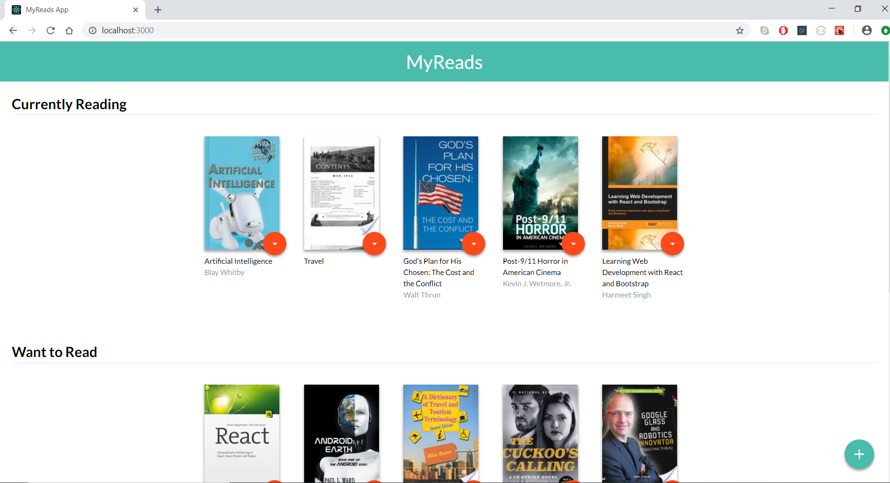

# MyReads App

 This project was created as part of Udacity Front-End Nanodegree. This is a personal bookshelf manager App built with React that allows the user to keep track of books sorted into three shelves: "currently reading", "want to read", and "read". The user can transfer books between shelves, remove books, and add books by searching via the backend BookAPI provided by Udacity.

 

## Getting Started

These instructions will get you a copy of the project up and running on your local machine.

### Prerequisites

You need to have [`npm`](https://www.npmjs.com/) installed on your device. to check if you have [`npm`](https://www.npmjs.com/) run the following on your terminal:

```
npm --version
```

### Installing

* Clone this repository.
* Open a terminal and navigate to the project directory then run Run `npm install` to install the project dependencies.
* Run the app using `npm start` .
* You can open the App at: localhost:3000.

## Important
 The backend API uses a fixed set of cached search results and is limited to a particular set of search terms, which can be found in [SEARCH_TERMS.md](SEARCH_TERMS.md). That list of terms are the _only_ terms that will work with the backend, so don't be surprised if your searches for Basket Weaving or Bubble Wrap don't come back with any results.
